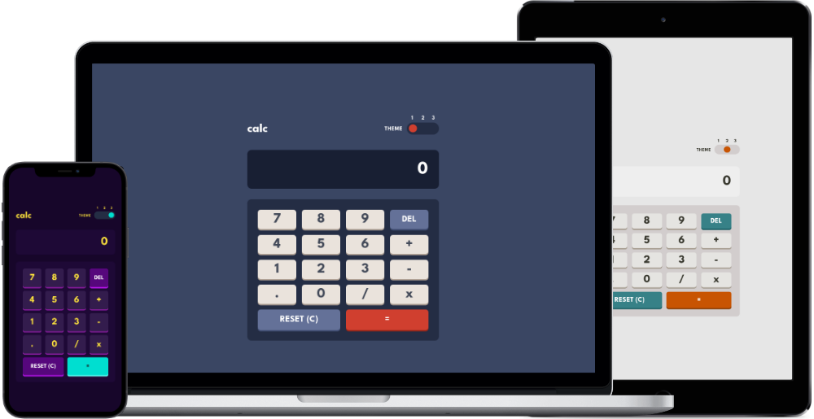

# Frontend Mentor - Calculator app solution

This is a solution to the [Calculator app challenge on Frontend Mentor](https://www.frontendmentor.io/challenges/calculator-app-9lteq5N29). Frontend Mentor challenges help you improve your coding skills by building realistic projects. 

## Table of contents

- [Overview](#overview)
  - [The challenge](#the-challenge)
  - [Screenshot](#screenshot)
  - [Links](#links)
- [My process](#my-process)
  - [Built with](#built-with)
  - [What I learned](#what-i-learned)
  - [Continued development](#continued-development)
- [Author](#author)

**Note: Delete this note and update the table of contents based on what sections you keep.**

## Overview

### The challenge

Users should be able to:

- See the size of the elements adjust based on their device's screen size
- Perform mathmatical operations like addition, subtraction, multiplication, and division
- Adjust the color theme based on their preference

### Screenshot

### Links

- Solution URL: [Frontend Mentor](https://www.frontendmentor.io/solutions/calculator-app-using-css-html-and-javascript-3LWfUxf5H5)
- Live Site URL: [Github Pages](https://jmcbutter.github.io/calculator-app/dist/index.html)

## My process

### Built with

- Semantic HTML5 markup
- CSS custom properties
- Flexbox
- CSS Grid
- JavaScript
- Mobile-first workflow

### What I learned

This project helped me get some more practice with changing themes via CSS custom
proprerties, manipulating the DOM with Javascript, and using regex to text input and make sure it fit certain criteria (such as only one decimal point in an operand).

### Continued development

I plan to spend some time learning how to best refactor my code to make it more readable. I will also be working on using git branches more to help with version control, especially as I make potentially breaking changes that may need to be rolled back.

## Author

- Website - [Jordan Butterfield](https://jmbutterfield.com)
- Github - [@jmcbutter](https://github.com/jmcbutter)
- Frontend Mentor - [@jmcbutter](https://www.frontendmentor.io/profile/jmcbutter)
- LinkedIn - [Jordan Butterfield](https://www.linkedin.com/in/jordan-butterfield-933274a9/)
